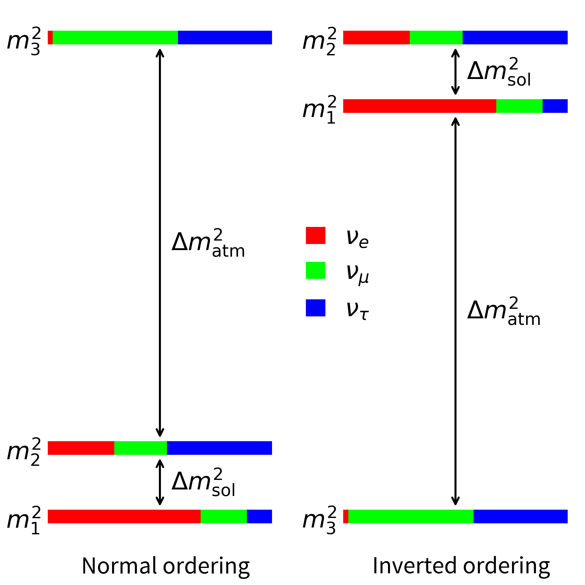
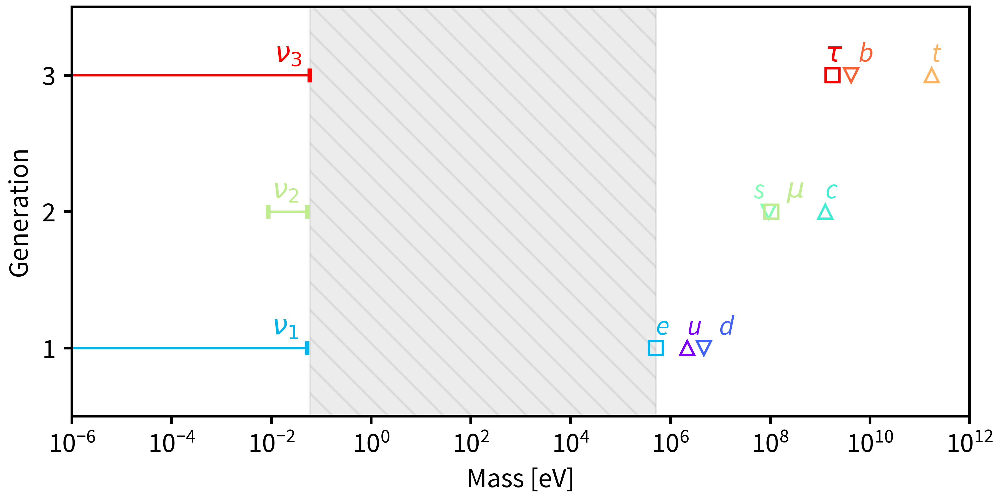
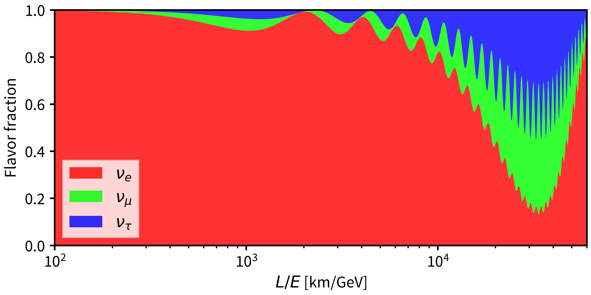
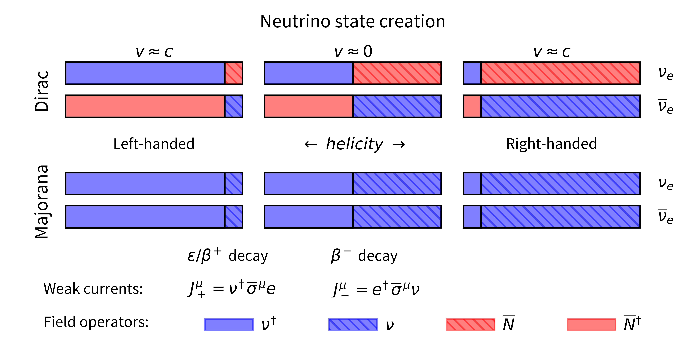
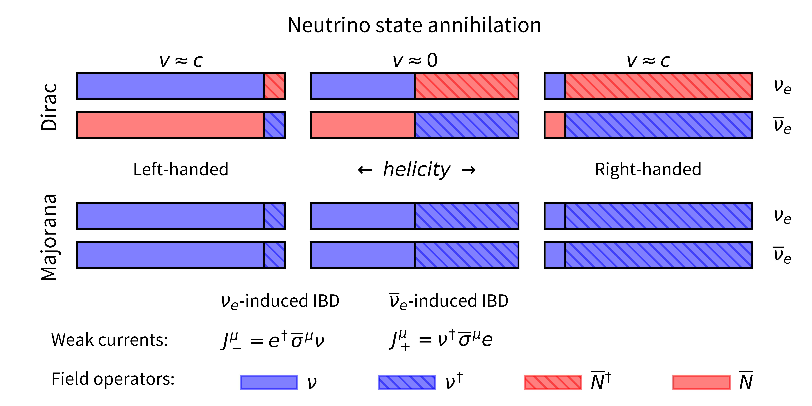
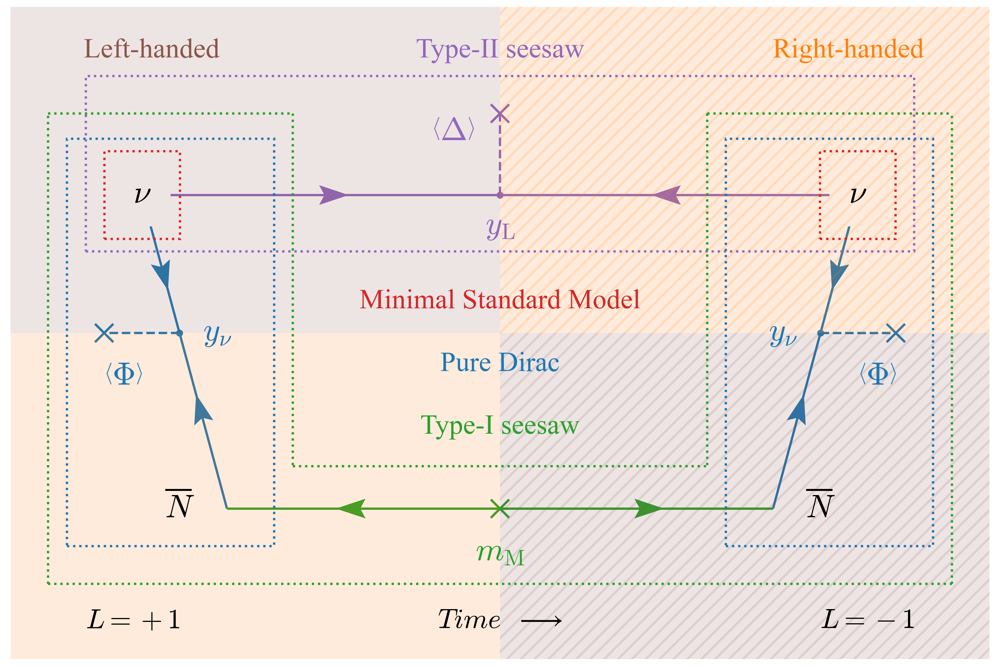
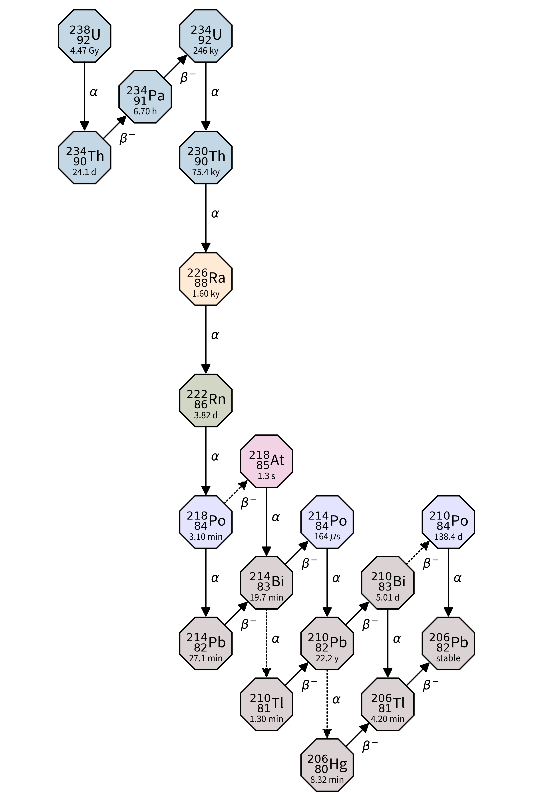
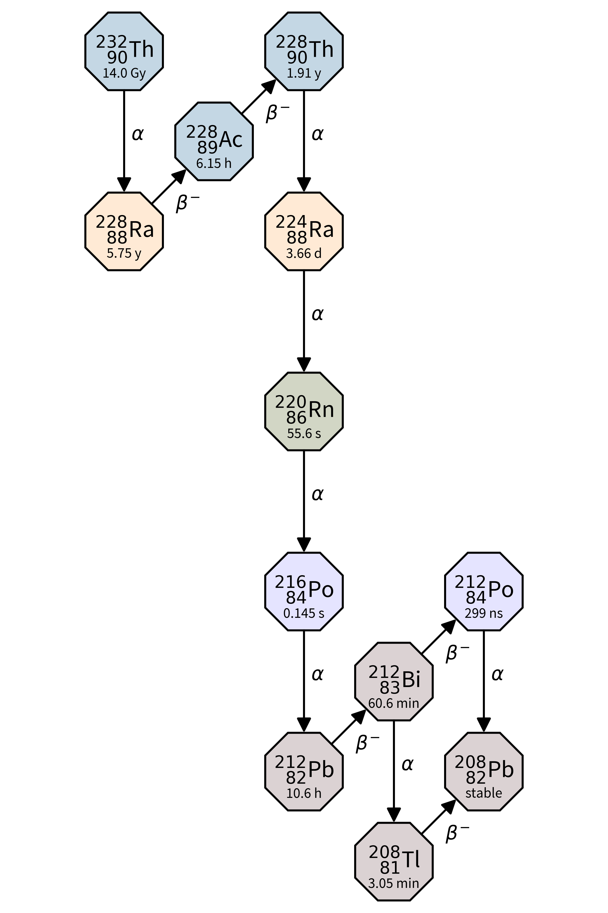

# NeutrinoPlots

## About

This package is intended to enable the user to easily reproduce some of the typical plots used in neutrino physics for papers, theses, or talks. Most of these plots can be produced with a single call to a function in [the `nuplots` module](src/nuplots/nuplots.py). The package also includes code to reproduce the "lobster plot," with the option to show the probability density in the parameter space in addition to the usual 3&sigma; contours. This is done using a Markov Chain Monte Carlo (MCMC) to sample the marginalized posterior distribution of the effective Majorana mass, as described in Ref. \[1\].

## Installation

The package can be installed by running the following from the top-level directory:
```bash
pip install -e .
```
During this step the dependencies listed in [requirements.txt](requirements.txt) will be automatically installed. For this reason it is recommended to install the package in a virtual python environment using `venv`, `virtualenv`, or `conda`. To uninstall, run:
```bash
pip uninstall nuplots
```

## Usage
### Basic Plots
After installation with pip, the data handling and plotting functions can be imported from their respective modules using:
```python
from nuplots.load_data import *
from nuplots.nuplots import *
```
The plots below can then be produced using the relevant function call. Some functions take an array of colors as an argument to be used in the plots; if no argument is provided a default set of colors (usually selected from the tab10 color cycle) will be used. All functions take an optional `font` argument to set the font to be used in the plots. Both native fonts and any additional fonts added to the [`fonts`](fonts/) folder can be used. Any other plot style options should be set using a matplotlib style sheet. The `save_path` argument can be provided to any of the plotting functions to save the plots at the time of creation.

#### Mass ordering scenarios
A diagram illustrating the normal and inverted mass ordering scenarios can be produced by first loading the neutrino oscillation parameters and then calling the `mass_ordering` function:
```python
params = load_params()
mass_ordering(params)
```



#### Absolute mass scale
The absolute scale of the neutrino masses can be shown in comparison to the other fermion masses:
```python
params = load_params()
fermion_masses = load_fermion_masses()
mass_scale(fermion_masses, params)
```



#### Oscillation probability
The oscillation probability for a neutrino initially produced in the electron flavor can be shown using:
```python
params = load_params()
oscillation(params)
```



#### Dirac and Majorana spinors
I came up with the plots below as a way to help visualize the field operator expansion of Dirac and Majorana spinors. They are meant to make clear when Dirac/Majorana neutrinos/antineutrinos can participate in interactions of a given kind; i.e. when are the interactions forbidden vs just strongly helicity suppressed.
```python
spinors(creation=True)
spinors(creation=False)
```




#### Mass generation mechanisms
This schematic summarizes the main mass generation mechanisms, both in the minimal Standard Model and the simplest Seesaw-inspired extensions. The lengthy caption below the figure attempts to explain everything going on in this admittedly busy schematic.



> Caption: A schematic summarizing the most commonly-considered neutrino mass generation scenarios. Arrows on fermion lines indicate the flow of chirality. In the Minimal SM (red boxes), there is no interaction between the left-handed and right-handed states, and the neutrino is massless. By adding the right-chiral field $\overline{N}$, without giving it a Majorana mass term, $\nu$ (left-handed) and $\overline{N}$ (right-handed) can interact via the Higgs field $\Phi$ and the neutrinos acquire a Dirac mass, $m_\mathrm{D}$. Still, there are two distinct neutrino and antineutrino states (blue boxes). Giving $\overline{N}$ a Majorana mass term connects particles and antiparticles (green box) and the neutrinos acquire a mass from the Type-II seesaw mechanism, $m_\mathrm{D}^2/m_\mathrm{M}$. Alternatively, one can do away with $\overline{N}$ altogether, and instead add a Higgs triplet $\Delta$ that couples to $\nu$ with coupling strength $y_\mathrm{L}$ to the SM. This pairs up the left- and right-handed states, giving a pure Majorana mass, $m_\mathrm{L}$, via a Type-I seesaw mechanism (purple box). Taking time to be from left to right, the processes allowed under the Type-I and Type-II seesaw mechanism scenarios depict the annihilation of a neutrino in the unhatched region and creation of an antineutrino in the hatched region. Note that the upper and lower diagrams represent mutually exclusive processes.

#### Decay chains
While not strictly neutrino-related, the $^{238}\mathrm{U}$ and $^{232}\mathrm{Th}$ decay chains play a large role in the design and operation of many low-background experiments (such as searches for $0\nu\beta\beta$). The functions used below allow for arbitrary decay chains or portions thereof to be shown with custom font/color choices.

```python
u238_chain = load_decay_chain('U-238')
th232_chain = load_decay_chain('Th-232')
decay_chain(u238_chain)
decay_chain(th232_chain)
```





### Vanilla Lobster Plot
The code should work right out of the box to produce the "vanilla" lobster plot, showing only the 3&sigma; allowed region. This can be done with the `lobster_vanilla` function:

```python
params = load_params()
lobster_vanilla(params)
```

With the default number of points and samples, the script should run in under a minute, but the contours may be jagged in places. The arguments `npoints` and `nsamples` can be used to make smoother lines. An example plot with 1e5 samples for each of 200 points is shown below.


### Density Lobster Plot

Before making the probability density lobster plot, the MCMC must first be run to produce the sample chains. This can be done using the `mcmc` function, though as it can take a long time to run, the scriptified version (which can be run in a screen/tmux session) may be preferred:

```bash
python run_mcmc.py
```

This will produce the chains with the default number of samples for normal ordering. To get the sample chains for inverted ordering, run:

```bash
python run_mcmc.py --io
```

Once both sample chains have been saved, the script to produce the lobster plot can be run with the paths to the saved sample chains as command line arguments. If the scripts were run as above, then the following should work to make the plot:

```bash
python lobster_density.py samples_no_500000.npy samples_io_500000.npy --allowed
```

This will produce a much lower quality version of the plot below. Increasing the number of walkers and iterations used by the MCMC will increase the plot quality.


## Data
Many of the plotting functions require the best fit or 3&sigma; ranges of the oscillation parameters. These are included in [data/params.yaml](data/params.yaml). Also included in that file are the phase-space factor and ab-initio nuclear matrix element for <sup>136</sup>Xe and the axial-vector coupling constant. The last three are used only to produce the probability density lobster plot. The fermion masses and decay chain data are also required for the relevant plots; these too are in the [data](data/) folder in YAML format.

To produce the probability density lobster plot, &Delta;&chi;<sup>2</sup> curves are required for some of the physical observables. The data for the oscillation parameters is available for download from [NuFIT 6.0 (2024), www.nu-fit.org](https://www.nu-fit.org) \[2\]. The specific files required can be found in [src/utils/load_data](src/utils/load_data). Limits are also required on the effective electron neutrino mass and the effective Majorana mass. The code currently uses data from KATRIN and KamLAND-Zen for these, respectively. The required data is included as supplemental material with Refs. \[3\] and \[4\]. All of these files should be put in the [data](data) directory.

## License

Distributed under the MIT License. See [LICENSE](`LICENSE`) for more information.

## Author

Clarke Hardy - [clarke.hardy@yale.edu](mailto:clarke.hardy@yale.edu)

## References

1. Agostini *et al* PRD **96**, 053001 (2017) [doi:10.1103/PhysRevD.96.053001](https://doi.org/10.1103/PhysRevD.96.053001)
2. Esteban *et al* J. High Energ. Phys. **2024**, 216 (2024) [doi:10.1007/JHEP12(2024)216](https://doi.org/10.1007/JHEP12(2024)216)
3. The KATRIN Collaboration Nat. Phys. **18**, 160–166 (2022). [doi:10.1038/s41567-021-01463-1](https://doi.org/10.1038/s41567-021-01463-1)
4. S. Abe *et al* (KamLAND-Zen Collaboration) Phys. Rev. Lett. **130**, 051801 (2023) [doi:10.1103/PhysRevLett.130.051801](https://doi.org/10.1103/PhysRevLett.130.051801)

