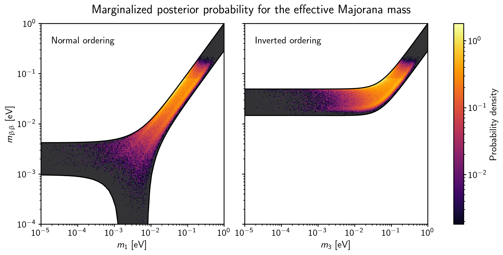

# NeutrinoPlots

## About

This package is intended to enable the user to easily reproduce some of the typical plots used in neutrino physics for papers, theses, or talks. Currently, code has been implemented to reproduce the "lobster plot," with the option to show the probability density in the parameter space in addition to the usual 3σ contours. This is done using a Markov Chain Monte Carlo (MCMC) to sample the marginalized posterior distribution of the effective Majorana mass, as described in Ref. \[1\].

## Installation

The package can be installed by running the following from the top-level directory:
```bash
pip install -e .
```
During this step the dependencies listed in [requirements.txt](requirements.txt) will be automatically installed. For this reason it is recommended to install the package in a virtual python environment using `venv`, `virtualenv`, or `conda`. To uninstall, run:
```bash
pip uninstall neutrinoplots
```

## Usage
### Vanilla Lobster Plot
After installation, the code should work right out of the box to produce the "vanilla" lobster plot, showing only the 3σ allowed region. This can be done by running:

```bash
cd scripts
python lobster_vanilla.py
```

With the default number of points and samples, the script should run in under a minute but the lines may be jagged in places. The command line arguments `--npoints` and `--nsamples` can be used to make smoother lines. An example plot with 1e5 samples for each of 200 points is shown below.


### Density Lobster Plot

Before running the script to make the density lobster plot, the MCMC must first be run to produce the sample chains. This can be done using:

```bash
python run_mcmc.py
```

This will produce the chains with the default number of samples for normal ordering. To get the sample chains for inverted ordering, run:

```bash
python run_mcmc.py --io
```

Once both sample chains have been saved, the script to produce the lobster plot can be run with the paths to the saved sample chains as command line arguments. If the scripts were run as above, then the following should work to make the plot:

```bash
python lobster_density.py samples_no_500000.npy samples_io_500000.npy --allowed
```

This will produce a much lower quality version of the plot below. Increasing the number of walkers and iterations used by the MCMC will increase the plot quality.



## Data
The vanilla Lobster plot requires only the 3&sigma; ranges of the oscillation parameters. These are included in [data/params.yaml](data/params.yaml). Also included in that file are the phase-space factor and ab-initio nuclear matrix element for <sup>136</sup>Xe and the axial-vector coupling constant. The last three are used only to produce the density plot.

To produce the density plot, &Delta;&chi;<sup>2</sup> curves are required for some of the physical observables. The data for the oscillation parameters is available for download from [NuFIT 5.2 (2022), www.nu-fit.org](www.nu-fit.org) \[2\]. The specific files required can be found in [src/utils/load_data](src/utils/load_data). Limits are also required on the effective electron neutrino mass and the effective Majorana mass. The code currently uses data from KATRIN and KamLAND-Zen for these, respectively. The required data is included as supplemental material with Refs. \[3\] and \[4\]. All of these files should be put in the [data](data) directory.

## License

Distributed under the MIT License. See [LICENSE](`LICENSE`) for more information.

## Author

Clarke Hardy - [cahardy@stanford.edu](mailto:cahardy@stanford.edu)

## References

1. Agostini *et al* PRD **96**, 053001 (2017) [doi:10.1103/PhysRevD.96.053001](https://doi.org/10.1103/PhysRevD.96.053001)
2. Esteban *et al* J. High Energ. Phys. **2020**, 178 (2020) [doi:10.1007/JHEP09(2020)178](https://doi.org/10.1007/JHEP09(2020)178)
3. The KATRIN Collaboration Nat. Phys. **18**, 160–166 (2022). [doi:10.1038/s41567-021-01463-1](https://doi.org/10.1038/s41567-021-01463-1)
4. S. Abe *et al* (KamLAND-Zen Collaboration) Phys. Rev. Lett. **130**, 051801 (2023) [doi:10.1103/PhysRevLett.130.051801](https://doi.org/10.1103/PhysRevLett.130.051801)

